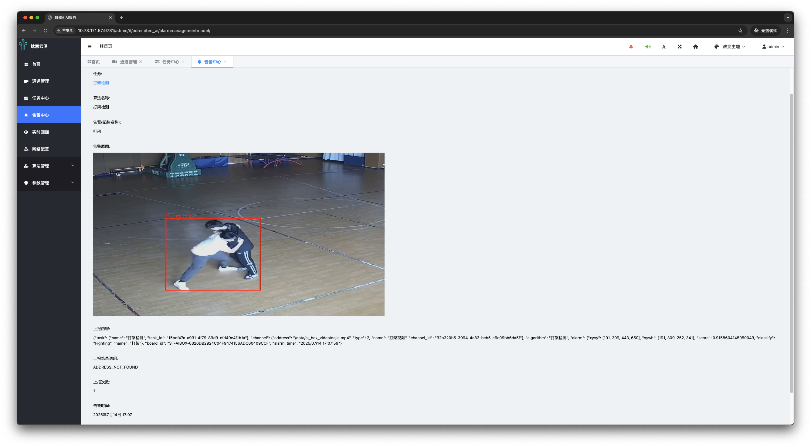

# 🧠 THYX: AIoT Edge Intelligence Video Analysis Platform

**THYX** is an edge-side intelligent video analysis platform designed for AIoT scenarios. It integrates video stream
access, behavior recognition, intelligent alerting, and visual management, covering the full workflow from algorithm
configuration to concurrent multi-task analysis. The platform features high-performance inference, a modular
architecture, and supports lightweight deployment across various edge devices with flexible scene combinations and
hot-pluggable extensions.

With built-in voice announcements, pop-up alerts, real-time video display, and a web management backend, THYX delivers
an intuitive and efficient human-computer interaction experience. It is widely applied in industries such as security,
manufacturing, and transportation, helping build stable and reliable intelligent perception systems.

---

  [中文文档](./README_ZH.md)

---

## 📸 Platform Features Overview

THYX provides a full end-to-end workflow for intelligent video analysis, from video stream access to intelligent alerts
and visual presentation. Key features include:

- Flexible dynamic license management for platform-level and scenario-level algorithms
- Supports RTSP, RTMP, and local video access with unified multi-stream management
- Concurrent multi-task processing with customizable real-time analysis per stream
- Real-time alerts (voice + pop-up) and searchable historical alert records
- Real-time display of scene analysis per stream for intuitive understanding
- Visual network configuration interface for easier deployment
- Online dynamic adjustment of algorithm thresholds, with quick access to algorithm list and descriptions
- Real-time configurable global parameters

### ✅ Sample Scenario Capabilities (more available as plug-ins)

| Scenario Name      | Application Scene                  | Detection Example Image                                                           |
|--------------------|------------------------------------|-----------------------------------------------------------------------------------|
| Helmet Detection   | Construction sites, factory safety |    |
| Fire Detection     | Forest fire prevention, factories  |            |
| Smoking Detection  | Gas stations, hospitals, plants    |           |
| Fighting Detection | Campuses, malls, subways, prisons  |           |
| Post Detection     | Duty rooms, production lines       |  |

> Dozens of scenario algorithms are already implemented.
> See: [Algorithm Config](./static/img/4-taskCenter03-channelAlgorithmConfiguration.png) / [Algorithm List](./static/img/8-algorithmManagement02-alarmCategoryList.png)

---

## 🎯 Key Advantages

- **High-Performance Edge Inference**  
  Concurrent multi-stream processing with <200ms per-stream latency; supports 1080P real-time analysis  
  

- **Modular Architecture**  
  Plugin-based modules support hot-plugging and hot updates. Unified AI inference service with flexible alarm
  management  
  

- **Full-Scenario Coverage**  
  Covers security, traffic, industrial, fire protection, etc. Includes plug-and-play pre-trained models and supports
  rapid integration of custom scenes  
  

- **Smart Interaction**  
  Provides a visual task configuration UI, video display, real-time voice alerts and pop-up notifications  
  

---

## 🚀 Quick Deployment Guide

### 1. Clone the Repository

```bash
sudo mkdir /data && cd /data
git clone https://github.com/senthree3/THYX.git
cd THYX
```

### 2. Install the Python Virtual Environment

Download the pre-built
environment [venv.tar.gz](https://drive.google.com/file/d/1ox8ZCT5734cUE8fU3D4u3kgQ1yoCzPFI/view?usp=sharing) and
extract it into the project directory:

```bash
tar -xzf venv.tar.gz
```

> A `venv/` folder should appear after extraction

### 3. Download Model Weights

Download the [model package](https://drive.google.com/file/d/1LEjrW6xrL8StjLoHroGaTkB0YH_JYxPo/view?usp=sharing),
extract it into the project root, and rename to `plugins/`:

```bash
unzip models.zip -d ./plugins
```

### 4. Run Deployment Script

```bash
chmod +x deploy.sh
sudo ./deploy.sh
```

### 5. Collect Static Files

```bash
source /opt/ai_box/venv/bin/activate 
python manage.py collectstatic
```

### 6. Reboot Device

```bash
sudo reboot
```

### 7. Access the Platform

Open your browser and visit:

```
http://<device-ip-address>
```

Default credentials:

- Username: `admin`
- Password: `admin`

> The platform itself is hardware-agnostic. The provided algorithm plugins currently support **SOPHGO BM1684 series**.
> For other chipsets, cross-compilation and model adaptation is required.

---

## 🧩 Core Modules

### 📷 Channel Management

Supports RTSP, RTMP, local video file access with unified stream management  


### 📊 Task Center

Configure multiple scene algorithms per stream. Supports dynamic parameter tuning, 3rd-party alerting, region setup, and
task monitoring  
  


### 🚨 Alarm Center

Multi-dimensional search (by channel, time, type), with event details and playback  


### 🖥️ Real-Time Screen

Displays real-time AI analysis of all streams for intuitive situational awareness  


---

## 🛠 Tech Stack Overview


- Deployment: Bare-metal edge deployment, no cloud dependency

---

## 📦 Project Structure

```
THYX/
├── ai_box/               # Middleware and config
├── bm_ai/                # Algorithm scheduling core
├── content/              # Runtime cache
├── logs/                 # Log files
├── media/                # Media assets
├── mosquitto-offline/    # Offline MQTT data
├── plugins/              # Algorithm plugins (hot-pluggable)
├── server/               # Nginx config
├── static/               # Static files (JS, CSS, images)
├── templates/            # HTML templates
├── venv/                 # Python virtual environment
├── ai_box.db             # SQLite database
├── deploy.sh             # One-click deployment script
├── manage.py             # Django main script
├── restart_all.sh        # Restart all services
├── run_all.sh            # Start all services
├── stop_all.sh           # Stop all services
├── README.md             # English README
└── README_ZH.md          # Chinese README
```

---

## 📝 License

This project is licensed under the Apache License 2.0. See [LICENSE](./LICENSE) for full details.

---

## 🙌 Acknowledgments

This platform is based on the [sophon-stream](https://github.com/sophgo/sophon-stream) video engine and built
with [Django](https://github.com/django/django).  
Special thanks to the community and partners for their continuous support of AIoT video intelligence applications.

---

## 📮 Contact

- Project: [https://github.com/senthree3/THYX](https://github.com/senthree3/THYX)
- Issues: [GitHub Issues](https://github.com/senthree3/THYX/issues)
- Email:
    - senthree30@gmail.com
    - 717192305@qq.com
