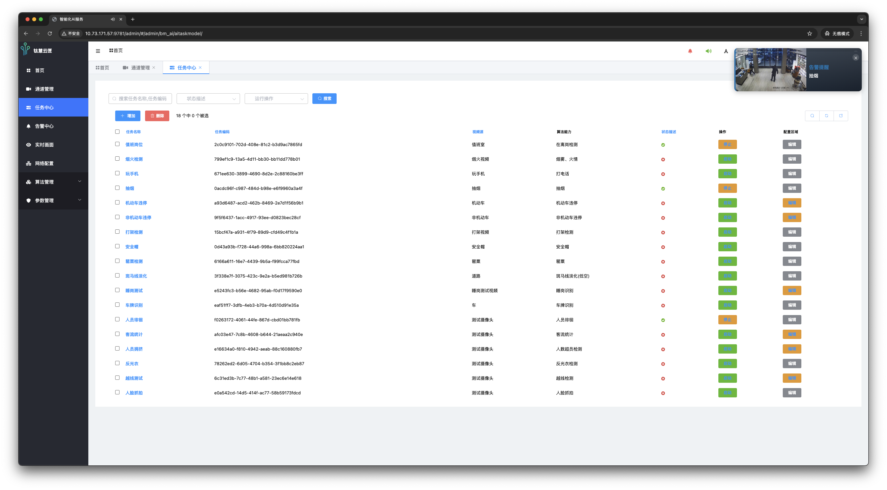
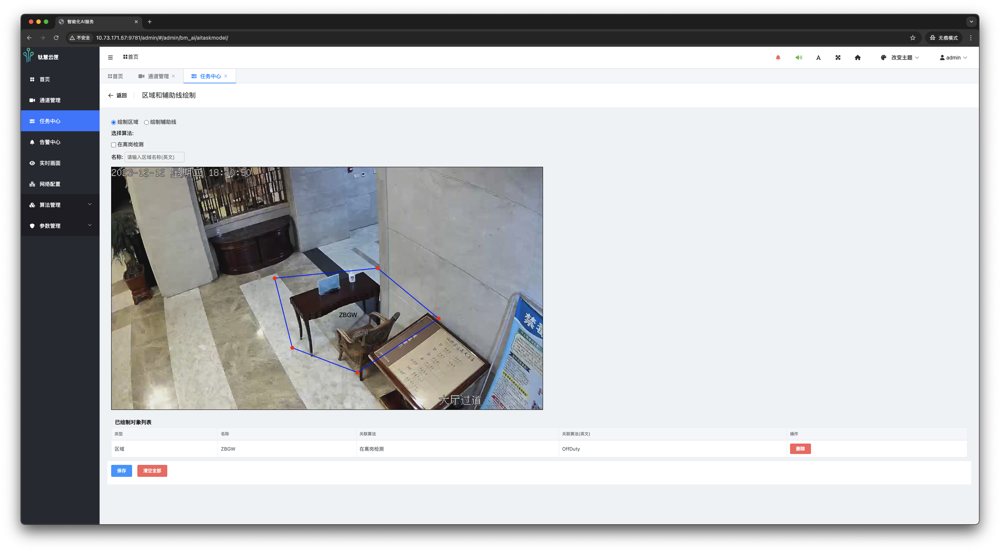
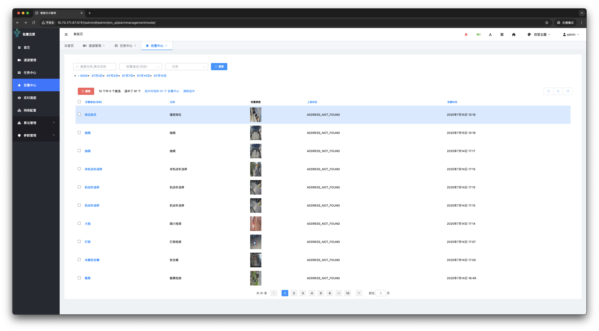
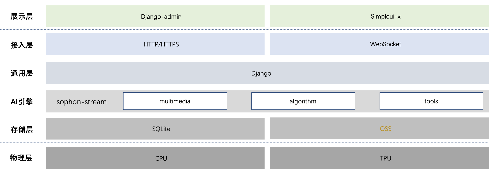

# 🧠 钛慧云匣：AIoT 边端智能视频分析平台

**钛慧云匣**是一款面向 AIoT 场景的边端智能视频分析平台，集成视频接入、行为识别、智能告警与可视化管理功能，覆盖从算法配置到多任务并发分析的全流程。平台具备高性能推理能力，采用模块化架构设计，支持多场景灵活组合与热插拔扩展，适配多种边缘计算设备轻量部署运行。

通过内置语音播报、弹窗提醒、实时画面展示与 Web 管理后台，钛慧云匣提供直观高效的人机交互体验，广泛应用于安防、工业、交通等行业，助力构建稳定可靠的智能感知系统。

---

## 📸 平台功能总览

钛慧云匣提供端到端的视频智能分析全流程，集成从视频流接入、算法配置、行为识别到智能告警与展示的全部能力。核心功能包括：

- 支持平台级与场景级算法灵活切换的动态授权管理
- 多种格式视频接入支持（RTSP、RTMP、本地视频等），实现多路视频统一接入与集中管理
- 支持多任务并发处理，按需为每路视频配置多种场景化分析能力
- 支持实时告警（语音提示 + 弹窗提醒）与历史告警事件的查询与回溯
- 实时呈现各路视频流的场景分析画面，提升分析直观性与响应效率
- 提供可视化的网络配置界面，简化部署流程
- 支持算法阈值在线动态调整，快速查询与查看算法清单和描述信息
- 全局运行参数可在线配置并实时更新

### ✅ 配场景能力介绍（部分示例）

| 场景能力名称 | 应用场景 | 检测图片示例 |
|--------|---------|-------------|
| 安全帽检测  | 建筑工地、工厂作业安全 |  |
| 烟火检测   | 森林防火、工厂消防 |  |
| 抽烟识别   | 加油站、医院禁烟区、化工厂 |  |
| 打架检测   | 校园安全、商场治安、地铁、监狱 |  |
| 在离岗检测 | 监控室、生产线、门卫、电力岗位 |  |

> 系统已实现数十种视频场景能力算法，详见：[算法配置](./static/img/4-taskCenter03-channelAlgorithmConfiguration.png)、[算法列表](./static/img/8-algorithmManagement02-alarmCategoryList.png)

---

## 🎯 核心优势

- **高性能边端推理**  
  多路视频流并发处理，单路推理延迟 < 200ms，支持 1080P 高清实时分析  
  

- **模块化架构设计**  
  插件化场景模块支持热插拔与热更新，统一视频 AI 推理服务，结合灵活的告警管理体系  
  

- **全场景覆盖**  
  覆盖安防、交通、工业、消防等行业，内置预训练模型即插即用，支持自定义集成与能力库持续更新  
  

- **智能交互体验**  
  提供可视化任务配置界面、视频展示、语音播报告警和弹窗提醒，优化人机交互体验  
  

---

## 🚀 快速部署指南

### 1. 克隆项目

```bash
sudo mkdir /data && cd /data
git clone https://github.com/senthree3/THYX.git
cd THYX
```

### 2. 安装虚拟环境

请下载预先打包的 Python 虚拟环境压缩包 [venv.tar.gz](https://drive.google.com/file/d/1ox8ZCT5734cUE8fU3D4u3kgQ1yoCzPFI/view?usp=sharing)，并解压到当前项目目录：

```bash
tar -xzf venv.tar.gz
```

> 解压完成后应存在 `venv/` 目录

### 3. 下载模型权重

下载[模型权重包](https://drive.google.com/file/d/1LEjrW6xrL8StjLoHroGaTkB0YH_JYxPo/view?usp=sharing)，解压至项目根目录并重命名为 `plugins/`：

```bash
unzip models.zip -d ./plugins
```

### 4. 启动部署脚本

```bash
chmod +x deploy.sh
sudo ./deploy.sh
```

### 5. 收集静态文件

```bash
source /opt/ai_box/venv/bin/activate 
python manage.py collectstatic
```

### 6. 重启设备

```bash
sudo reboot
```

### 7. 启动访问

浏览器访问设备 IP：

```
http://<设备IP地址>
```

默认登录信息：

- 用户名：admin
- 密码：admin

> 本平台不依赖芯片架构，当前模型组件适配 **SOPHGO BM1684 系列设备**。如需适配其他芯片型号，请重新交叉编译插件并完成模型兼容性适配。

---

## 🧩 平台核心模块详解

### 📷 通道管理

支持多种格式（RTSP、RTMP、本地文件）的视频流接入，统一管理各类视频源  


### 📊 任务中心

每路视频可配置多个算法，支持动态参数调整、可视区域设置、告警上报与任务监控  
  


### 🚨 告警中心

支持按描述、通道、时间等多维度检索，展示事件类型、时间与画面，并支持回放  


### 🖥️ 实时画面

展示多路 AI 视频分析结果，便于直观掌握算法效果与现场状态  


---

## 🛠 技术架构



- 部署方式：边端裸机部署，无需依赖云端服务

---

## 📦 项目结构简述

```
THYX/
├── ai_box/                 # 项目配置与运行控制
├── bm_ai/                  # 算法调度与核心模块
├── content/                # 运行时缓存目录
├── logs/                   # 日志文件目录
├── media/                  # 媒体资源缓存
├── mosquitto-offline/     # MQTT 离线部署数据
├── plugins/                # 算法插件目录（热插拔支持）
├── server/                 # Nginx 服务配置
├── static/                 # 前端静态资源（JS、CSS、图像）
├── templates/              # HTML 页面模板
├── venv/                   # Python 虚拟环境
├── ai_box.db               # 本地数据库（SQLite）
├── deploy.sh               # 一键部署脚本
├── manage.py               # Django 管理入口
├── restart_all.sh          # 重启服务脚本
├── run_all.sh              # 启动服务脚本
├── stop_all.sh             # 停止服务脚本
├── README.md               # 英文说明文档
└── README_ZH.md            # 中文说明文档
```

---

## 📝 开源协议

本项目遵循 Apache License 2.0 开源许可协议，详情见 [LICENSE](./LICENSE)。

---

## 🙌 致谢

本项目基于 [sophon-stream](https://github.com/sophgo/sophon-stream) 视频引擎，并结合 [Django](https://github.com/django/django) 构建。  
感谢社区与合作伙伴对 AIoT 视频智能分析场景的持续支持。

---

## 📮 联系方式

- 项目主页：[https://github.com/senthree3/THYX](https://github.com/senthree3/THYX)
- 问题反馈：[GitHub Issues](https://github.com/senthree3/THYX/issues)
- 邮箱：
  - senthree30@gmail.com
  - 717192305@qq.com
